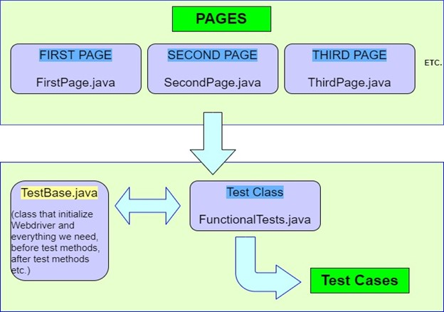

### java-selenium-pom-ar.hoteles

# What is Page Object Model - POM?

Page Object Model is a design pattern to create an "object repository" for WebUI elements. It wraps all elements, actions, validations happening on a page in one single object - Page Object. Under this model, for each web page in the application, there should be the corresponding page class.

Page Object Model (POM) is a Design Pattern which is very popular in Selenium Test Automation. It is widely used design pattern and it can highly enhance test maintenance and reduce code duplication.

In POM web pages are represented as simple classes, and the various web elements on the page are defined as variables and used in methods. The tests then use these methods of page object classes whenever they need to interact with the UI of the certain page.

For example, we have a login page of some sort. We locate all needed elements on that page with webdriver. Then, we write methods that use that elements. So, we have all elements and all methods that we want to use in our tests in one simple class. In test class we just call the that methods with suitable arguments for certain test case.
Every page that we need to interact with, should have its own class with elements and methods (Page Object Class).

# Participants

The classes and objects relating in this pattern are:

* Page Object (GoogleCalculatorPage): contains properties of all necessary web elements of the page, the methods which perform operations on those elements and validators for comparing the expected results.

* Test Class (GoogleCalculatorTest): contains a group of test cases related to given page. It can hold only one instance of the described page object.

# Why is good to use POM ?

Code will be cleaner since by POM design pattern we should keep our tests and element locators separately. So, it will be easier to maintain code when something in the UI is changed.
We can keep our page objects in separate repository (Page Object Repository). That will give us an opportunity to use for different purposes with different frameworks.
Test cases will be a lot shorter since we could reuse methods from POM classes.

# What is Page Factory?

Page Factory is an extension to Page Objects, primarily used for initialization of the web elements defined in the page classes (or page objects). Web elements used with Page Objects have to be initialized before they can be used further and Page Factory simplifies the initialization with the initialization method.